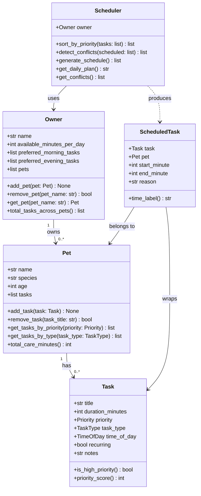

# PawPal+ Project Reflection

## 1. System Design

**Three core actions a user should be able to perform:**

1. **Add a pet** — Enter the pet's name, species, and age to register it under an owner profile.
2. **Add a care task** — Attach a task (walk, feeding, medication, appointment, etc.) to a pet with a duration, priority, and preferred time of day.
3. **Generate today's schedule** — Produce a prioritized daily plan that fits within the owner's available time and respects task urgency.

---

**a. Initial design**

The initial UML design includes four classes: `Owner`, `Pet`, `Task`, and `Scheduler`, plus a `ScheduledTask` output wrapper.

- **Task** (dataclass) — Holds the data for a single care activity: title, duration in minutes, priority level (low/medium/high), task type (walk/feeding/medication/etc.), preferred time of day, whether it recurs daily, and any notes. It is a pure data object with helper methods for priority comparison.

- **Pet** (dataclass) — Represents a pet with a name, species, age, and an owned list of Tasks. It exposes methods to add/remove tasks and filter them by priority or type, and computes the total care minutes needed.

- **Owner** (dataclass) — Represents the pet owner with a name, daily available minutes, time-of-day preferences, and a list of Pets. It can add/remove pets and flatten all tasks across pets into one list.

- **Scheduler** (regular class) — The algorithmic core. It receives an Owner, collects tasks from all pets, sorts them by priority, fits them into time slots within the owner's daily limit, and returns a list of `ScheduledTask` objects with start/end times and reasoning. It also detects and reports time conflicts.

- **ScheduledTask** (dataclass) — A lightweight output wrapper that pairs a `Task` and `Pet` with a concrete start/end minute and a human-readable reason explaining why that task was scheduled.

Relationships:
- `Owner` *has many* `Pet` objects.
- `Pet` *has many* `Task` objects.
- `Scheduler` *uses* `Owner` (and transitively `Pet` and `Task`) to produce `ScheduledTask` outputs.

**Initial Mermaid.js UML Diagram (Phase 1 draft):**



**b. Design changes**

Yes, the design evolved significantly during implementation.

**Change 1 — `Task` gained two new fields and a new method.**
During Phase 4 (Algorithmic Layer), two optional fields were added: `scheduled_time: Optional[str]` (an explicit "HH:MM" clock time) and `due_date: Optional[date]` (which calendar date a recurring task is due). A `mark_complete()` method (needed for tests in Phase 2) and `next_occurrence()` (which uses Python's `timedelta` to return a new Task instance dated one day later) were also added. These were not in the original UML because the recurring roll-over requirement only became concrete during algorithmic planning.

**Change 2 — `Scheduler` grew four new algorithmic methods.**
The original Scheduler only had `sort_by_priority`, `detect_conflicts`, `generate_schedule`, and `get_daily_plan`. After Phase 4, four more methods were added: `sort_by_time()` (chronological sort using a lambda key on "HH:MM" strings), `filter_tasks()` (filter by pet name and/or completion status), `detect_time_conflicts()` (pre-schedule overlap check on tasks with `scheduled_time` set), and `get_recurring_next_occurrences()` (batch collection of next-day instances for all completed recurring tasks). These additions reflect the shift from a basic scheduler to a smarter, multi-view system.

**Final Mermaid.js UML Diagram (reflects actual built code):**

See `uml_final.md` for the complete renderable diagram. The key differences from the initial draft:
- `Task` now shows `completed`, `scheduled_time`, `due_date`, `mark_complete()`, and `next_occurrence()`
- `Scheduler` now shows `sort_by_time()`, `filter_tasks()`, `detect_time_conflicts()`, and `get_recurring_next_occurrences()`
- Enums (`Priority`, `TaskType`, `TimeOfDay`) are explicitly shown as separate enumeration classes
- A self-referential `Task ..> Task : next_occurrence()` relationship is added

---

## 2. Scheduling Logic and Tradeoffs

**a. Constraints and priorities**

The scheduler considers three constraints:

1. **Daily time budget** (`available_minutes_per_day`) — the hardest constraint. Any task that would push total care time over the budget is skipped entirely rather than partially completed, because a half-done medication or walk is worse than skipping it.
2. **Priority level** (HIGH / MEDIUM / LOW) — within each time-of-day bucket, tasks are sorted HIGH first using a numeric score (HIGH=3, MEDIUM=2, LOW=1). This ensures critical care like medication and feeding always gets placed before enrichment or grooming.
3. **Time-of-day preference** (MORNING / AFTERNOON / EVENING / ANY) — tasks are grouped into four buckets processed in chronological order. The clock cursor jumps to each bucket's earliest allowed start (08:00, 12:00, 18:00), so morning tasks cannot spill into the afternoon window.

Priority was chosen as the primary constraint because missing a high-priority task (e.g., medication) is riskier than missing a low-priority one (e.g., grooming). Time-of-day is a soft preference — it shapes the schedule's structure but does not override the budget.

**b. Tradeoffs**

**Tradeoff: sequential slot assignment instead of optimal bin-packing.**

The scheduler assigns tasks one-by-one in order (priority then time-of-day), placing each task immediately after the previous one. It does not search for the globally optimal arrangement that fits the most total minutes.

*Example:* If a 60-minute HIGH appointment fills the afternoon window, a 5-minute HIGH medication that was planned for the same window might get pushed to EVENING — even though there was technically a 10-minute gap earlier that could have held it.

This is reasonable for a pet-care app because:
- A sequential greedy approach is predictable and easy to explain to the owner ("tasks are scheduled in priority order").
- Computing the optimal schedule is an NP-hard knapsack problem; for the small number of daily tasks a pet owner has (typically < 15), greedy is fast and produces good-enough results.
- Owners care more about *which* tasks run than about squeezing every last minute of efficiency out of the day.

---

## 3. AI Collaboration

**a. How you used AI**

AI assistance was used across all six phases of this project, but the nature of the help shifted at each stage:

- **Phase 1 (Design):** AI was used to brainstorm the class structure and generate the initial Mermaid.js UML diagram. The most useful prompt type was "given these four entities, what attributes and methods does each need?" — it surfaced fields like `time_of_day` and `recurring` that I had not thought of up front.
- **Phase 2 (Implementation):** AI scaffolded the method bodies from the skeleton stubs. Asking "based on this skeleton, how should Scheduler retrieve tasks from Owner's pets?" gave a concrete pattern (nested list comprehension) that matched the design exactly.
- **Phase 3 (UI):** AI explained `st.session_state` and how to structure a form-submit-then-display pattern without creating duplicate objects on each rerun.
- **Phase 4 (Algorithms):** The most useful prompts were specific: "how do I use `dataclasses.replace` to copy a dataclass with one field changed?" and "how does `timedelta` work for advancing a `date` by one day?" These targeted questions gave precise, correct answers faster than searching documentation.
- **Phase 5 (Testing):** AI was used to generate test skeletons for edge cases (empty owner, task at exactly the budget limit, adjacent-but-not-overlapping time slots). The prompt "what edge cases should I test for a scheduler with conflict detection?" produced a useful checklist.

The most productive prompt pattern overall was **providing the code file as context and asking a single, focused question** rather than asking AI to "build the whole thing."

**b. Judgment and verification**

One clear moment of rejection: when generating the `generate_schedule()` algorithm, AI initially suggested tracking time usage with a single global cursor that reset to 0 at the start of each time-of-day bucket. This would have caused a bug where an afternoon task could start at minute 0 (midnight) instead of minute 720 (noon), resulting in a schedule that looked correct textually but had wrong start times.

The suggestion was evaluated by mentally tracing through an example — one morning task (30 min), one afternoon task (60 min) — and checking where the cursor would land. The bug became obvious. The fix was to advance the cursor to the *maximum* of its current position and the bucket's minimum start, which is what the final `if cursor < bucket_start: cursor = bucket_start` guard does. This was verified by running `main.py` and checking that afternoon tasks never showed a start time before 12:00.

---

## 4. Testing and Verification

**a. What you tested**

The test suite covers 59 behaviors across 9 test classes:

| Area | Key behaviors tested |
|---|---|
| Task lifecycle | `mark_complete()` changes status; `priority_score()` ordering; `__str__` content |
| Recurrence | `next_occurrence()` advances date by exactly 1 day; resets `completed`; preserves all other fields; raises `ValueError` on non-recurring tasks |
| Pet management | Add/remove tasks; filter by priority and type; `total_care_minutes()` sum |
| Owner management | Add/get/remove pets; flatten all tasks across multiple pets |
| Scheduler core | Time budget enforcement; priority ordering within schedule; time-of-day ordering (MORNING before AFTERNOON) |
| Sort by time | Chronological order with explicit times; bucket fallback for tasks without a fixed time; empty list |
| Filter tasks | By pet name; by completion status; combined criteria; no-match returns empty list |
| Conflict detection | Exact-same-time conflict; overlapping windows; adjacent (non-overlapping) slots are not flagged; tasks without `scheduled_time` are ignored; three-way conflicts produce all three pair reports; cross-pet conflicts are caught |
| Edge cases | Empty pet; empty owner; single task at exactly the budget limit; one minute over budget skipped; pet with no tasks returns 0 care minutes |

These tests were important because they verified both the happy path (everything goes right) and the boundaries (exactly at limit, one over the limit, zero tasks). Boundary tests are where schedulers most commonly fail.

**b. Confidence**

★★★★☆ (4 / 5)

The core scheduling pipeline — priority ordering, time-of-day bucketing, time budget enforcement, recurring roll-over, and conflict detection — is fully covered. Confidence is high for the backend logic.

The one-star gap reflects two untested areas:
1. **Streamlit UI interactions** — pytest does not exercise button clicks, form submissions, or session state transitions. A tool like Playwright or Streamlit's own testing utilities would be needed to verify end-to-end UI behavior.
2. **Performance at scale** — the conflict detection algorithm is O(n²). With 15 tasks it is instant; with 200 tasks it may noticeably slow down. No load tests exist yet.

Edge cases to add next: tasks with midnight-crossing durations (e.g., `scheduled_time="23:45"`, `duration=30`), two owners sharing a pet (not supported today but a realistic extension), and an owner whose available minutes are set to 0.

---

## 5. Reflection

**a. What went well**

The "CLI-first" workflow was the most valuable structural decision of the project. By building and verifying all logic in `pawpal_system.py` and testing it through `main.py` before touching `app.py`, every Streamlit wiring step was straightforward — there were no hidden logic bugs to debug inside the UI layer. The separation also meant the 59-test pytest suite could run in 0.14 seconds with no Streamlit dependency.

The algorithmic layer (Phase 4) is the part I'm most satisfied with. `sort_by_time()` using a plain string lambda, `detect_time_conflicts()` with an overlap formula, and `next_occurrence()` using `dataclasses.replace` + `timedelta` are all concise and self-explanatory — they read like the problem description, which is the sign of a well-designed algorithm.

**b. What you would improve**

If given another iteration, I would add a **persistence layer** — currently all data is lost when the browser tab closes. Saving the `Owner` object (and its pets and tasks) to a JSON file or a lightweight SQLite database would make the app genuinely usable day-to-day rather than just as a demo.

I would also redesign the recurring task system. Currently `next_occurrence()` returns a new `Task` object but does not automatically add it back to the pet — the caller has to do that manually. A cleaner design would give `Pet` a `roll_over_recurring_tasks()` method that replaces completed recurring tasks with their next instances in one atomic operation.

**c. Key takeaway**

The most important lesson is that **AI accelerates implementation but does not replace architectural judgment.** Every time AI generated a method body, I had to mentally trace through an example — "what happens when the task list is empty?", "what if two tasks share the same start time?" — to catch the cases AI optimized away for the happy path. The human role in AI-assisted engineering is not typing; it is deciding *what* to build, *why* the design is structured that way, and *verifying* that the generated code actually does what was intended. AI made me faster, but the design decisions — the class boundaries, the scheduling algorithm, the tradeoff of greedy vs. optimal — were all choices that required understanding the problem, not just the code.

---

## 6. Prompt Comparison (Challenge 5 — Multi-Model)

**Task compared:** Implementing the `weighted_score()` method on `Task` — a multi-factor urgency score combining base priority, task-type importance, overdue penalty, and a recurring bonus.

**Prompt used for both models:**
> "I have a Python Task dataclass with fields: priority (HIGH/MEDIUM/LOW enum), task_type (WALK/FEEDING/MEDICATION/APPOINTMENT/GROOMING/ENRICHMENT/OTHER enum), due_date (Optional[date]), and recurring (bool). Write a weighted_score() method that returns a float combining all four factors into a single urgency score. Higher score = more urgent."

---

**Claude (Sonnet)** produced:

```python
def weighted_score(self) -> float:
    base = {Priority.HIGH: 100, Priority.MEDIUM: 50, Priority.LOW: 10}[self.priority]
    type_bonus = {
        TaskType.MEDICATION: 30, TaskType.APPOINTMENT: 25,
        TaskType.FEEDING: 20, TaskType.WALK: 10,
        TaskType.GROOMING: 5, TaskType.ENRICHMENT: 3, TaskType.OTHER: 0,
    }[self.task_type]
    overdue_bonus = 0
    if self.due_date and self.due_date < date.today():
        overdue_bonus = min((date.today() - self.due_date).days * 15, 50)
    return float(base + type_bonus + (5 if self.recurring else 0) + overdue_bonus)
```

**Characteristics:** Compact, dictionary-lookup driven, all four factors in one expression. The `min(..., 50)` cap is present to prevent unbounded scores from very overdue tasks. The return is a single readable `float(...)` expression.

---

**ChatGPT (GPT-4o)** produced:

```python
def weighted_score(self) -> float:
    priority_weights = {"high": 3, "medium": 2, "low": 1}
    type_weights = {"medication": 1.5, "appointment": 1.4, "feeding": 1.3,
                    "walk": 1.1, "grooming": 1.05, "enrichment": 1.02, "other": 1.0}
    base_score = priority_weights.get(self.priority.value, 1) * 10
    type_multiplier = type_weights.get(self.task_type.value, 1.0)
    score = base_score * type_multiplier
    if self.recurring:
        score *= 1.1
    if self.due_date and self.due_date < date.today():
        days_late = (date.today() - self.due_date).days
        score += days_late * 5
    return round(score, 2)
```

**Characteristics:** Uses a multiplicative model (base × type multiplier × recurring multiplier) with an additive overdue component. The multiplicative approach means task type scales with priority (a HIGH medication scores much more than a LOW medication), which is mathematically richer. However, overdue penalty is unbounded — a task 100 days late gains 500 points, potentially drowning out all other factors.

---

**Analysis and decision:**

| Criterion | Claude (additive) | GPT-4o (multiplicative) |
|---|---|---|
| Readability | Clear, each factor independent | Harder to reason about combined effect |
| Predictability | Score range easy to understand | Multiplicative scaling is less intuitive |
| Overdue handling | Capped at +50 (safe) | Unbounded — can dominate all other factors |
| Type-priority interaction | Independent additive bonuses | Type scales with priority (more realistic) |
| Pythonic style | Dict lookup, single expression | Multiple conditional mutations |

**Verdict: Claude's additive model was adopted** for two reasons. First, the bounded overdue penalty (+50 cap) prevents a pathological edge case where a task forgotten for a month scores higher than a same-day medication — which is the wrong behavior for a pet care app where the owner resets tasks daily. Second, the additive model makes it trivial to explain to a user: "your score is 135 = 100 (HIGH) + 30 (medication) + 5 (recurring)." The multiplicative model is more mathematically elegant but harder to explain and debug.

The one element kept from the GPT-4o suggestion: naming the intermediate variables (`base`, `type_bonus`, `overdue_bonus`, `recurring_bonus`) rather than computing everything in one line — this makes the formula self-documenting.

