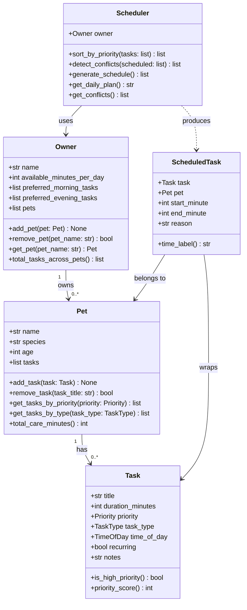

# PawPal+ Project Reflection

## 1. System Design

**Three core actions a user should be able to perform:**

1. **Add a pet** — Enter the pet's name, species, and age to register it under an owner profile.
2. **Add a care task** — Attach a task (walk, feeding, medication, appointment, etc.) to a pet with a duration, priority, and preferred time of day.
3. **Generate today's schedule** — Produce a prioritized daily plan that fits within the owner's available time and respects task urgency.

---

**a. Initial design**

The initial UML design includes four classes: `Owner`, `Pet`, `Task`, and `Scheduler`, plus a `ScheduledTask` output wrapper.

- **Task** (dataclass) — Holds the data for a single care activity: title, duration in minutes, priority level (low/medium/high), task type (walk/feeding/medication/etc.), preferred time of day, whether it recurs daily, and any notes. It is a pure data object with helper methods for priority comparison.

- **Pet** (dataclass) — Represents a pet with a name, species, age, and an owned list of Tasks. It exposes methods to add/remove tasks and filter them by priority or type, and computes the total care minutes needed.

- **Owner** (dataclass) — Represents the pet owner with a name, daily available minutes, time-of-day preferences, and a list of Pets. It can add/remove pets and flatten all tasks across pets into one list.

- **Scheduler** (regular class) — The algorithmic core. It receives an Owner, collects tasks from all pets, sorts them by priority, fits them into time slots within the owner's daily limit, and returns a list of `ScheduledTask` objects with start/end times and reasoning. It also detects and reports time conflicts.

- **ScheduledTask** (dataclass) — A lightweight output wrapper that pairs a `Task` and `Pet` with a concrete start/end minute and a human-readable reason explaining why that task was scheduled.

Relationships:
- `Owner` *has many* `Pet` objects.
- `Pet` *has many* `Task` objects.
- `Scheduler` *uses* `Owner` (and transitively `Pet` and `Task`) to produce `ScheduledTask` outputs.

**Mermaid.js UML Diagram:**

**b. Design changes**

- Did your design change during implementation?
- If yes, describe at least one change and why you made it.

---

## 2. Scheduling Logic and Tradeoffs

**a. Constraints and priorities**

The scheduler considers three constraints:

1. **Daily time budget** (`available_minutes_per_day`) — the most hard constraint. Any task that would push total care time over the budget is skipped entirely rather than partially completed, because a half-done medication or walk is worse than skipping it.
2. **Priority level** (HIGH / MEDIUM / LOW) — within each time-of-day bucket, tasks are sorted HIGH first using a numeric score (HIGH=3, MEDIUM=2, LOW=1). This ensures critical care like medication and feeding always gets placed before enrichment or grooming.
3. **Time-of-day preference** (MORNING / AFTERNOON / EVENING / ANY) — tasks are grouped into four buckets processed in chronological order. The clock cursor jumps to each bucket's earliest allowed start (08:00, 12:00, 18:00), so morning tasks cannot spill into the afternoon window.

Priority was chosen as the primary constraint because missing a high-priority task (e.g., medication) is riskier than missing a low-priority one (e.g., grooming). Time-of-day is a soft preference — it shapes the schedule's structure but does not override the budget.

**b. Tradeoffs**

**Tradeoff: sequential slot assignment instead of optimal bin-packing.**

The scheduler assigns tasks one-by-one in order (priority then time-of-day), placing each task immediately after the previous one. It does not search for the globally optimal arrangement that fits the most total minutes.

*Example:* If a 60-minute HIGH appointment fills the afternoon window, a 5-minute HIGH medication that was planned for the same window might get pushed to EVENING — even though there was technically a 10-minute gap earlier that could have held it.

This is reasonable for a pet-care app because:
- A sequential greedy approach is predictable and easy to explain to the owner ("tasks are scheduled in priority order").
- Computing the optimal schedule is an NP-hard knapsack problem; for the small number of daily tasks a pet owner has (typically < 15), greedy is fast and produces good-enough results.
- Owners care more about *which* tasks run than about squeezing every last minute of efficiency out of the day.

---

## 3. AI Collaboration

**a. How you used AI**

- How did you use AI tools during this project (for example: design brainstorming, debugging, refactoring)?
- What kinds of prompts or questions were most helpful?

**b. Judgment and verification**

- Describe one moment where you did not accept an AI suggestion as-is.
- How did you evaluate or verify what the AI suggested?

---

## 4. Testing and Verification

**a. What you tested**

- What behaviors did you test?
- Why were these tests important?

**b. Confidence**

- How confident are you that your scheduler works correctly?
- What edge cases would you test next if you had more time?

---

## 5. Reflection

**a. What went well**

- What part of this project are you most satisfied with?

**b. What you would improve**

- If you had another iteration, what would you improve or redesign?

**c. Key takeaway**

- What is one important thing you learned about designing systems or working with AI on this project?
