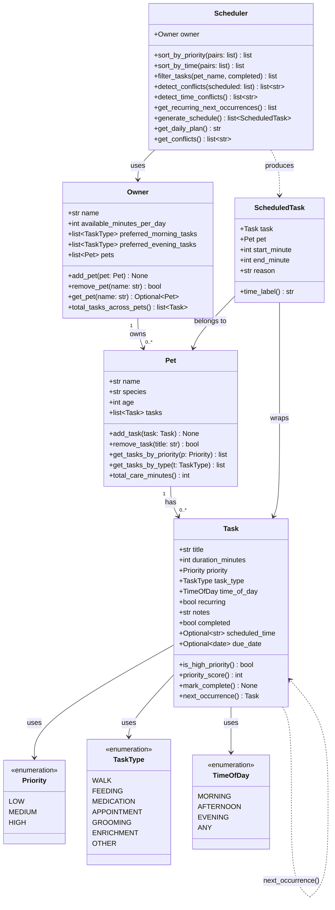

# PawPal+ — Final System Architecture (UML)

Paste the Mermaid code below into https://mermaid.live to render the diagram.

```mermaid
classDiagram
    class Priority {
        <<enumeration>>
        LOW
        MEDIUM
        HIGH
    }

    class TaskType {
        <<enumeration>>
        WALK
        FEEDING
        MEDICATION
        APPOINTMENT
        GROOMING
        ENRICHMENT
        OTHER
    }

    class TimeOfDay {
        <<enumeration>>
        MORNING
        AFTERNOON
        EVENING
        ANY
    }

    class Task {
        +str title
        +int duration_minutes
        +Priority priority
        +TaskType task_type
        +TimeOfDay time_of_day
        +bool recurring
        +str notes
        +bool completed
        +Optional~str~ scheduled_time
        +Optional~date~ due_date
        +is_high_priority() bool
        +priority_score() int
        +mark_complete() None
        +next_occurrence() Task
    }

    class Pet {
        +str name
        +str species
        +int age
        +list~Task~ tasks
        +add_task(task: Task) None
        +remove_task(title: str) bool
        +get_tasks_by_priority(p: Priority) list
        +get_tasks_by_type(t: TaskType) list
        +total_care_minutes() int
    }

    class Owner {
        +str name
        +int available_minutes_per_day
        +list~TaskType~ preferred_morning_tasks
        +list~TaskType~ preferred_evening_tasks
        +list~Pet~ pets
        +add_pet(pet: Pet) None
        +remove_pet(name: str) bool
        +get_pet(name: str) Optional~Pet~
        +total_tasks_across_pets() list~Task~
    }

    class ScheduledTask {
        +Task task
        +Pet pet
        +int start_minute
        +int end_minute
        +str reason
        +time_label() str
    }

    class Scheduler {
        +Owner owner
        +sort_by_priority(pairs: list) list
        +sort_by_time(pairs: list) list
        +filter_tasks(pet_name, completed) list
        +detect_conflicts(scheduled: list) list~str~
        +detect_time_conflicts() list~str~
        +get_recurring_next_occurrences() list
        +generate_schedule() list~ScheduledTask~
        +get_daily_plan() str
        +get_conflicts() list~str~
    }

    Owner "1" --> "0..*" Pet : owns
    Pet "1" --> "0..*" Task : has
    Task --> Priority : uses
    Task --> TaskType : uses
    Task --> TimeOfDay : uses
    Scheduler --> Owner : uses
    Scheduler ..> ScheduledTask : produces
    ScheduledTask --> Task : wraps
    ScheduledTask --> Pet : belongs to
    Task ..> Task : next_occurrence()
```
